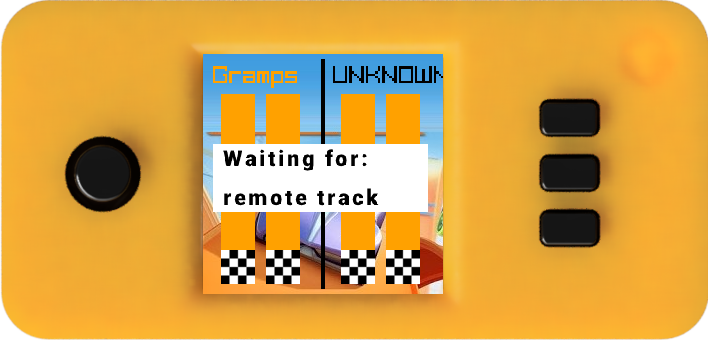
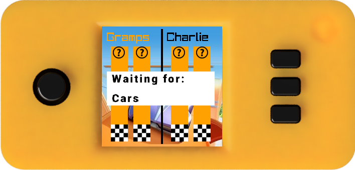
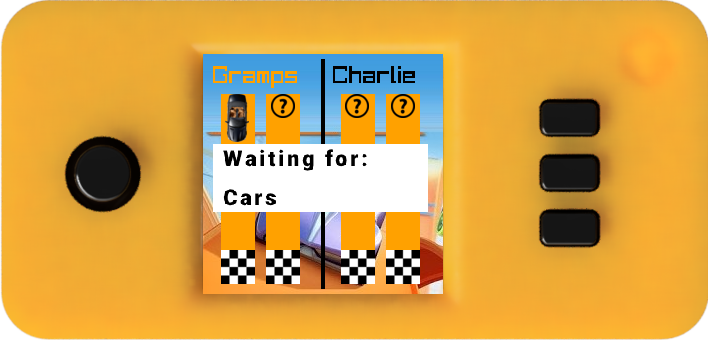
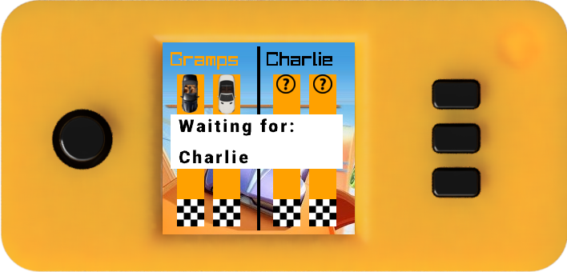
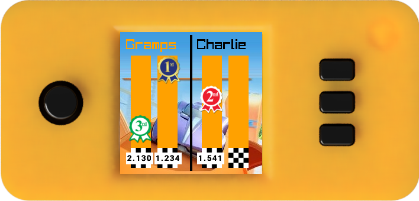
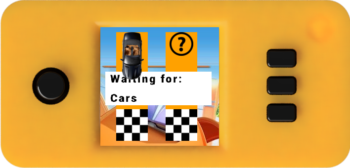
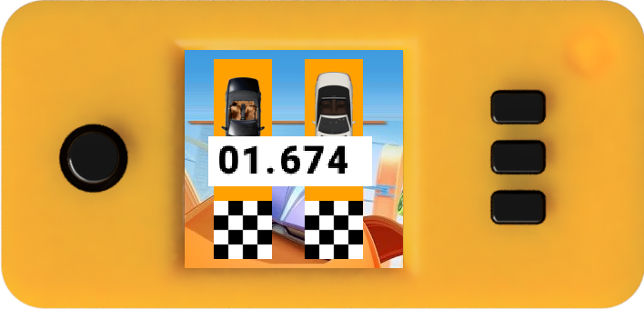
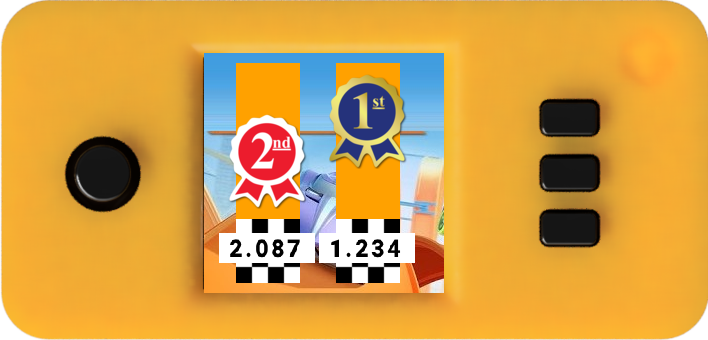

# Diecast-Remote-Raceway
The Diecast Remote Raceway (DRR) allows participants to race 1:64 scale die-cast cars (such as the popular Hot Wheels® cars from 
[Mattel](https://www.mattel.com/en-us)), head-to-head, from remote locations.  A DRR consists of an automated Starting Gate, an electronic Finish Line, and a web service that coordinates races between multiple raceways via the internet.

## Operation

Start by mounting the Starting Gate onto a suitable elevated surface. The mount on the bottom of
the Starting Gate can be attached to a [Hot Wheels Clamp
3-way](https://www.thingiverse.com/thing:4037458) to clamp onto a chair, desk, shelf or other
surface.  Alternatively, you can attach to a photography tripod using a [Hot Wheels Track Tripod Connector ](https://www.thingiverse.com/thing:4376073).

Next, attach track sections to build a track of your liking.  Terminate the track with the Finish
Line component.

Apply power to both the Starting Gate and Finish Line using 5 Volt sources
and mini-USB cables.  Most phone chargers or power packs work well to
provide power.  When the Starting Gate has completed its initialization,
the display should look like this:

* To race locally, push the top button next to "Single Track"
* To race against another track, push the middle button next to "Multi Track"
* To set configuration parameters such as selecting car icons, other tracks to race against, tack timeout or WiFi parameters, push the button next to "Configure"

Once a race mode has been selected (Single Track or Multi Track) the
Starting Gate will establish a Bluetooth connection to the Finish Line.
This may take a minute or more to complete, during which time the
following is displayed:

### Multi-Track Race

In a multi-track race was selected, the Starting Gate contacts the race controller to await
another participating track.  The following is displayed:

Upon return, the name of the remote track is displayed
and the Starting Gate awaits cars in each starting gate.

When a lane's sensor detects that a car has been placed in a lane, the "no
car" icon is replaced with the user's selected icon for that lane:

Once cars are present in all lanes of the local track the Starting Gate
contacts the race coordinator to signal that the track is ready to race and wait until the
remote track is also ready:

Once both tracks are ready, there is a 3 second countdown and the
race begins.  The elapsed time is displayed as the race progresses,
and the icons travel down the image of the track.

Finally, when all cars have finished (or the configured timeout is reached) the results of the
race are displayed:

and the starting gate barrier is raised to accept cars again.

To start next race, simply placing cars in the gates.  When the first car is placed, the
display clears the race results and goes back to the "Waiting for cars" state and the next race
proceeds.

### Single-Track Race

A Single Track race proceedes much like a Mulit Track but without the coordination with the
second track.  As soon as the connection to the Finish Line is established, the Starting Gate
waits for cars on the local track.

When a lane's sensor detects that a car has been placed in a lane, the "no
car" icon is replaced with the user's selected icon for that lane:

Once all cars are present, there is a 3 second countdown and the race begins.

When the race completes, the results are displayed:

and the starting gate barrier is raised to accept cars again.

To start next race, simply placing cars in the gates.  When the first car is placed, the
display clears the race results and goes back to the "Waiting for cars" state and the next race
proceeds.
